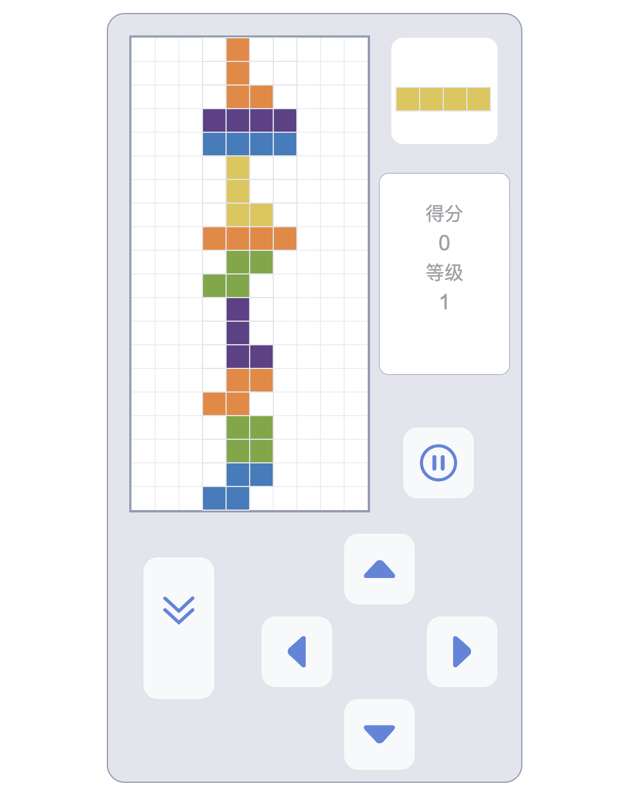
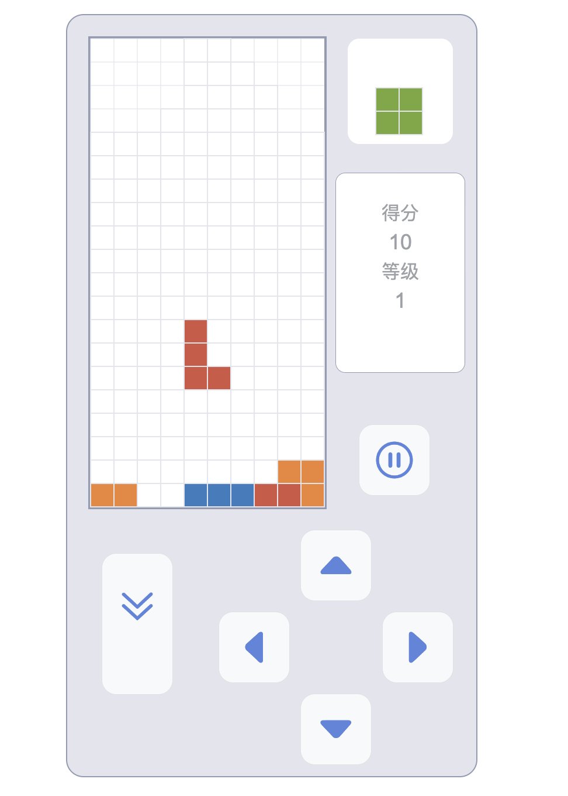

# 俄罗斯方块游戏

一个使用面向对象思想、 TypeScript、 Webpack、 CanvasAPI 开发的俄罗斯方块游戏，具有完整的游戏逻辑、得分系统和美观的用户界面。

## 介绍

### 游戏功能

-   支持所有标准方块形状（I、O、T、L、S）
-   支持左右移动、快速下降和瞬间下落
-   自动检测和消除满行，上方方块自动下落
-   消除 1 个方块得 1 分
-   每 100 分升一级
-   等级越高下落速度越快（最低 200ms）
-   得分、等级实时更新
-   下一个方块预览

### 操作控制

-   提供可视化按钮控制
-   方向键和空格键控制
-   可以暂停/继续游戏
-   Drop 按钮和空格键瞬间下落

## 目录结构

```
src/
├── config/           # 配置文件
│   ├── game.config.ts      # 游戏配置
│   ├── shape.config.ts     # 方块形状配置
│   ├── btns.config.ts      # 按钮配置
│   └── style.config.ts     # 样式配置
├── core/             # 核心游戏逻辑
│   ├── enums/             # 枚举定义
│   ├── interfaces/        # 接口定义
│   ├── manager/           # 管理器类
│   │   ├── actionManager.ts     # 操作管理
│   │   ├── gameDataManager.ts   # 游戏数据管理
│   │   └── sourceManager.ts     # 资源管理
│   ├── render/            # 渲染器
│   │   └── gameRenderer.ts      # 游戏渲染器
│   ├── types/             # 类型定义
│   ├── shape.ts           # 方块类
│   ├── square.ts          # 单元格类
│   └── game.ts            # 游戏主类
├── utils/            # 工具函数
│   ├── renderUtils.ts     # 渲染工具
│   ├── shapeUtils.ts      # 方块工具
│   └── index.ts           # 通用工具
└── index.ts          # 入口文件
```

## 游戏截图



